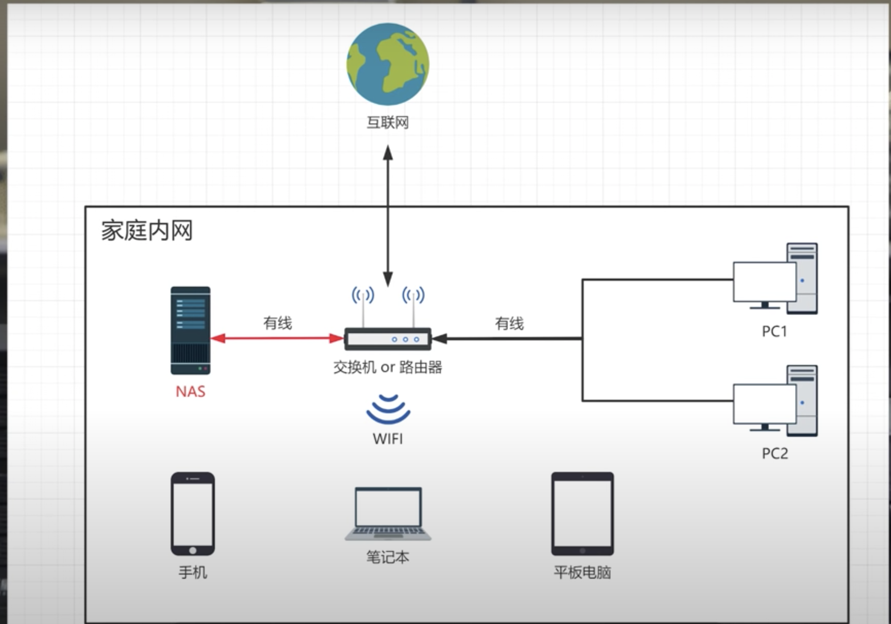

# NAS
Network Attached Storage 网络附接存储是一种文件级(与块级存储相对)的计算机数据存储服务器，它连接到计算机网络,并提供对异构网络用户的数据访问，它通常作为专门制造的专用计算机设备制造。 NAS系统是包含一个或多个通常排列成逻辑存储器、冗余存储器或RAID存储驱动器的网络设备。NAS消除了从网络上的其他服务器提供文件服务的负担，它们通常使用网络文件共享协议（如NFS、SMB或AFP）提供对文件的访问。作为一种在多台计算机之间共享文件的便捷方法，NAS设备从1990年代中期开始开始流行起来。与同样提供文件服务的通用服务器相比，专用网络附加存储的潜在优势包括更快的数据访问、更简单的管理和简单的配置。

 
nas可以让笔记本等存储扩展困难的设备方便地对大容量素材进行在线剪辑，而不需要额外的拷贝回电脑内置硬盘

## NAS的分类
- 私有云盘
    - 一般使用arm核心的机器，搭配简单的手机app,不会有非常强的性能以及复杂的功能，轻量化，一般都是单盘
    - 存放在家中的云盘设备，在同一内网环境有非常好的访问速度
- 全功能的品牌NAS
    - 群晖(synology), 威联通(qnap), 极空间，万由科技
    - 一般都用阵列以及文件系统，更加全面的文件权限管理
    - 更多的功能,取决于核心架构 arm还是x86, x86往往提高更多的性能支持, 比如实时转码，虚拟机，docker等功能上
- DIYNAS
    - 电脑上安装nas操作系统
    - 可以根据自己的需求，选择适合的操作系统以及硬件配置
    - 无法保证硬盘的供电，以及系统的稳定运行
    - 主流nas操作系统
        - trueNas, unraid, openmediavault

# 目录
- [存储](./storage/storage.md)
- [网络访问](./access/access.md)

