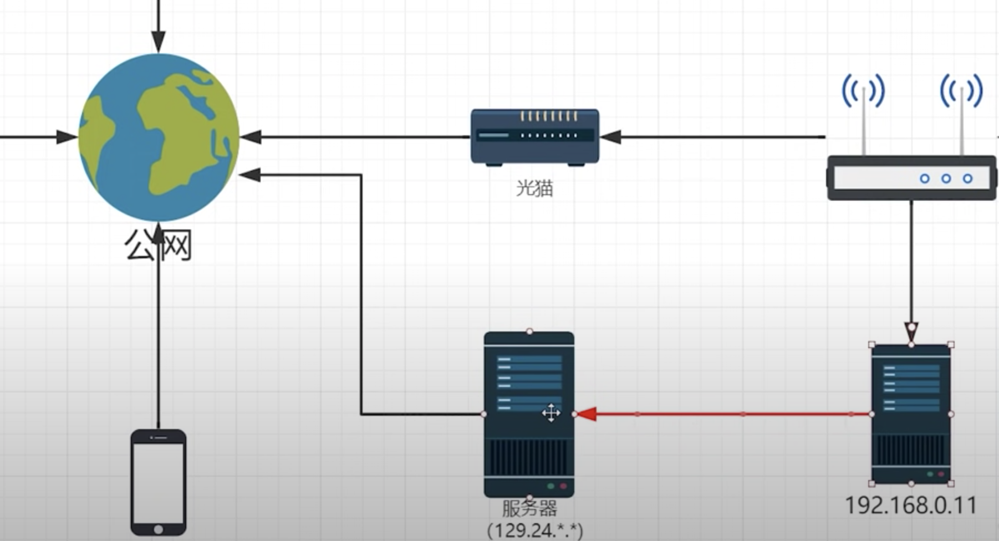

## 网络文件共享

#### 局域网访问
- NFS(network-file-system)网络文件系统
    一般用在UNIX系统和类Unix系统(Linux和FreeBSD)，Windows也有
    通过网络（一般是局域网也可互联网）让不同主机系统之间共享文件或目录
    NFS客户端可以通过挂载（mount）的方式将NFS服务器端共享的数据目录挂载到NFS客户端本地系统中

    #### 部署服务端
    1. nfsd守护进程
    2. /etc/exports 配置文件

    #### 客户端
    请求数据调用 mount -t nfs 192.168.1.5:/var/share /mnt/nfs

- SMB(服务器消息块)/CIFS(网络文件共享系统)
用在Uinx和Windows之间

#### 远程访问
1. 内网穿透(NAT穿透)
2. DDNS(是否有公网ip)

##### 内网穿透
 
1. 通信双方一台位于NAT之后

- 相关应用：frp（fast reverse proxy）高性能反向代理
 

##### DDNS
1. 手头有支持ddns设备
