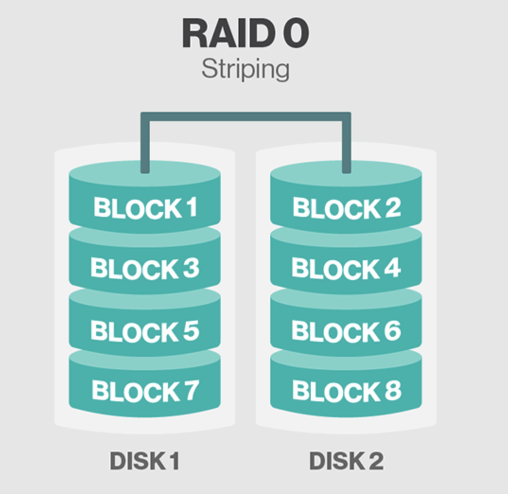
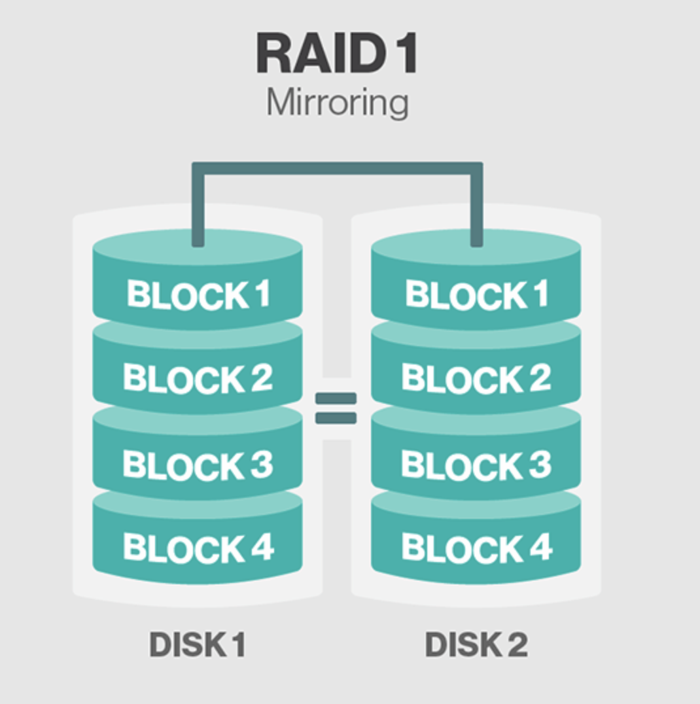
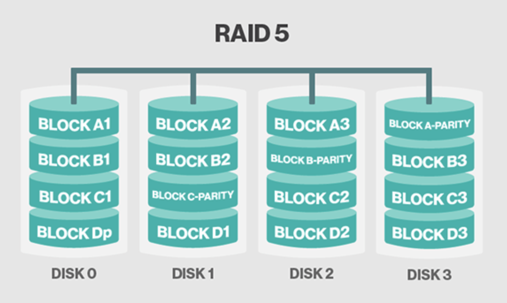
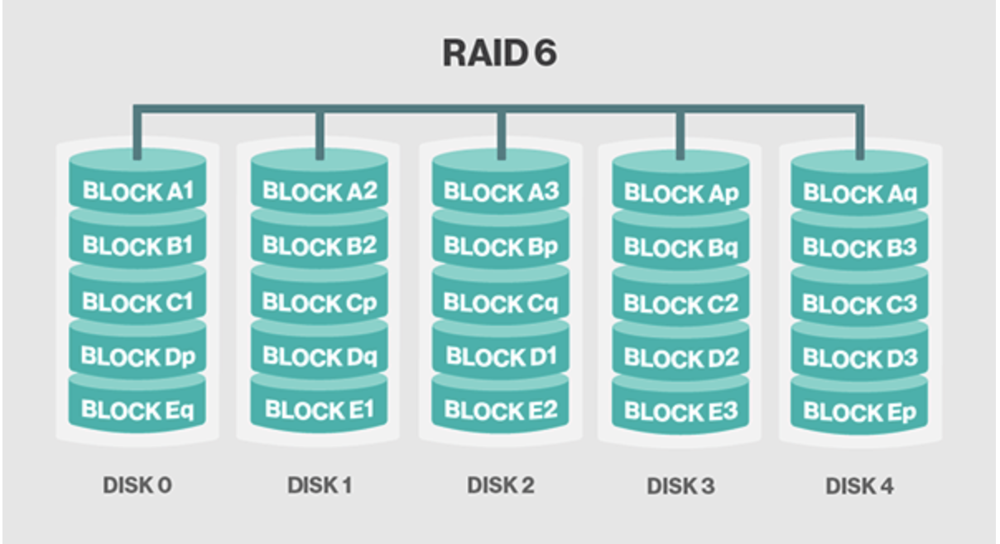
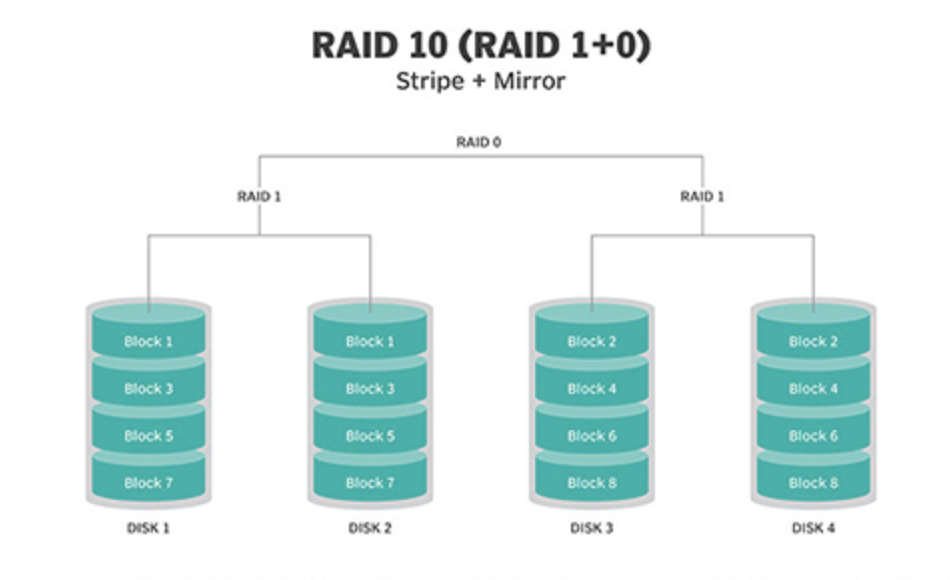
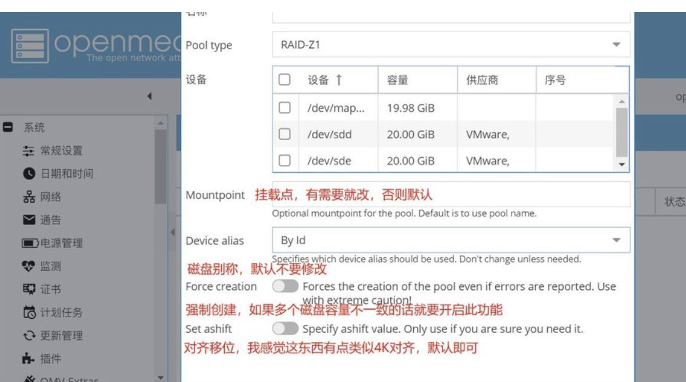

## 存储

现代硬盘的缺陷：io性能极弱，稳定性极差

NAS系统是包含一个或多个通常排列成逻辑存储器、冗余存储器或RAID存储驱动器的网络设备

#### 独立硬盘冗余阵列
利用虚拟化存储技术把多个硬盘组合起来，成为一个或多个硬盘阵列组，目的为提升性能或减少冗余，或是两者同时提升

在运作中，取决于 RAID 层级不同，资料会以多种模式分散于各个硬盘，RAID 层级的命名会以 RAID 开头并带数字，例如：RAID 0、RAID 1、RAID 5、RAID 6、RAID 7、RAID 01、RAID 10、RAID 50、RAID 60。每种等级都有其理论上的优缺点，不同的等级在两个目标间获取平衡，分别是增加资料可靠性以及增加存储器（群）读写性能

### RAID controller
是一个介于操作系统和物理硬盘之间的一个把陈列作为一个逻辑整体的控制器，他能提高性能保护数据

### RAID0
 
空间利用率：所有硬盘空间之和
性能：所有硬盘速度之和
冗余能力：无

### RAID1 

空间利用率：所有磁盘中最小的那块
性能：读性能为所有硬盘速度之和，写性能会有所减弱
冗余能力：只要有一块硬盘正常，数据就正常

### RAID5

每个driver分布一个parity, 即使其中一块硬盘坏了也能通过parity获得完整数据, raid5 至少需要3块硬盘,但为了体现性能上的有点，通常推荐至少用5块硬盘来组成阵列

raid5对写频繁操作的场景不是很友好，每次写数据的同时还要修改parity
空间利用率：1-1/n
性能：读性能接近RAID0,写性能较RAID0弱一些
冗余能力：可接受1块硬盘损坏

### RAID6

raid6 和 raid5比较相似, 与raid5相比它有2个parity
这意味着在2块硬盘损坏的情况下还是能读取数据，同时这也增加了成本，写入的效率也比raid5低

空间利用率：1-2/n
性能：读写性能接近RAID5,读性能比RAID5还要弱一点
冗余能力：可接受2块硬盘损坏

#### Nested RAID LEVEL
##### RAID10(RAID 1+0)

#### 实现
1. 软件RAID 通过系统功能或RAID软件实现RAID,没有独立硬件和接口，需要占用一定的系统资源(CPU,硬盘接口速度),并且受操作系统稳定性影响
2. 硬件RAID 通过独立的RAID硬件卡实现，有些主板集成RAID硬件，有些需要购买独立的RAID硬件卡，硬件RAID实现不需要占用其他硬件资源，稳定性和速度都比软件RAID要强

#### 设置
可以在bios中对RAID 进行设置 
https://docs.oracle.com/cd/E19432-01/820-7143-11/bios_RAID.html

## 文件系统
OMV 默认文件系统是EXT4
trueNas, unraid 是 ZFS 源自 freenas
ZFS文件系统是比较吃资源，尤其需要大内存，主机没有足够的性能建议不要用这个文件系统
### ZFS(https://itsfoss.com/what-is-zfs/, https://www.truenasscale.com/2021/12/20/353.html)
ZFS是一个拥有逻辑卷管理功能的文件系统，最早源自于Oracle为Solaris操作系统开发的文件系统。ZFS具有可扩展性，并且包括大量保护措施防止数据损坏，支持高存储容量、高效数据压缩、集成文件系统、卷管理、快照和写时复制、连续完整性检查与自动修复、RAID-Z、原生NFSv4 ACL等功能，并且能被精确配置。ZFS有两个主要实现，分别来自Oracle和OpenZFS，它们之间极度相似，这使得ZFS在类Unix系统中广泛可用。

### OMV 安装ZFS
- 安装proxmox内核，重启
- 插件 openmediavault-zfs后多处一个模块
- 创建设置zfs

